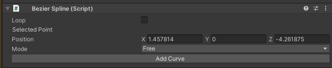
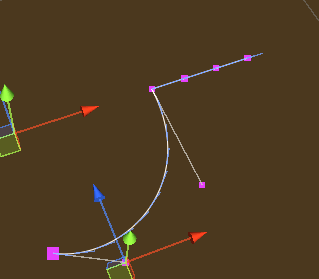

# Table of Contents

1. [Introduction](#introduction)
1. [Requirements](#requirements)
1. [Quick Start](#quick-start)
1. [Animate Transform Behavior](#animate-transform-behavior)
1. [Follow Path Behavior](#follow-path-behavior)
    - [Bezier Spline Path Property](#the-bezier-spline-path-property)
1. [Contact](#contact)

# Introduction
This add-on contains a collection of animation behaviors that allow VR Builder to display more complex animations than what is possible with the built-in tools. At the moment, it includes the following behaviors.

**Follow Path**: Causes an object to follow a given path.

**Animate Transform**: Updates an object's position, rotation and scale to match a "transform provider" game object. This completely supersedes the **Move Object** core behavior, which will be disabled when installing this add-on.

# Requirements
This add-on requires VR Builder version 0.5.0 or later to work.

When installed, the **Move Object** core behavior will be disabled in the menu, as its functionality is 100% included in the new **Animate Transform** behavior.
To manually enable it, go to `Tools > VR Builder > Developer > Allowed Menu Items Configuration`.

# Quick Start
The easiest way to get started with this add-on is to check out the included demo scene.

If it is the first time you open the demo scene, you will have to do it through the menu: `Tools > VR Builder > Demo Scenes > Animations`. This is necessary as a script will copy the demo course in the StreamingAssets folder. After the first time, the demo scene can be opened normally.

Press Play to try out the behaviors included in this add-on. The demo scene includes a station for every behavior. You can teleport there and check out some practical uses of the included behaviors.

Don't forget to check out the course itself for examples on how to use those behaviors! You can open the Workflow Editor through `Tools > VR Builder > Open Workflow Editor`.

# Animate Transform Behavior
## Introduction
This behavior animates a game object by changing its position, rotation and scale over time until it matches those of a "transform provider" game object. It is possible to set how position, rotation and scale are animated over time through separate animation curves.
The behavior can be found under `Animation > Animate Transform`.

## Inspector

The **Animate Transform** behavior accepts the following parameters.

**Object**: The game object to be moved.

**Final transform provider**: The game object which provides the final position, rotation and scale of the animation.

**Duration (in seconds)**: Duration in seconds of the animation.

**Position curve, Rotation curve, Scale curve**: These animation curves determine the object's transform at a given point in time. The curve can have values from 0 (the object's original position, rotation or scale) to 1 (the transform provider's position, rotation or scale). Note that the length of the curves is normalized: while it is possible to have the time axis greater or lesser than 1, this won't affect the duration of the animation - it is recommended to leave the time axis to the default length of 0 to 1.

**Ping pong**: If this is checked, the animation will play backwards after finishing, resulting in the object animating and then returning to the original position. Note the total duration will be twice the value in the `Duration` field. This is similar to creating a symmetrical velocity curve, like for example a bell shape.

**Repeats**: The number of times the animation will repeat. Note that each repeat will increase the duration of the animation by its full amount. If ping pong is set, it will be included in every repeat.

# Follow Path Behavior
## Introduction
This behavior animates a game object so that it follows a path, for example a spline. It is possible to set a curve determining how fast the object moves along the path, plus a number of options described below.
The behavior can be found under `Animation > Follow Path`.

## Inspector

The **Follow Path** behavior accepts the following parameters.

**Object**: The game object to be moved.

**Path**: The path the object will follow. This needs to be an `IPathProperty`, like the `BezierSplinePathProperty` provided in VR Builder Core.

**Keep relative position**: If unchecked, the object will be teleported on the path when the animation starts, and its position throughout the animation will be on the path itself. If checked, the object will retain its current position and move parallel to the path while animating.

**Keep relative rotation**: If unchecked, the object will rotate so that its forward vector follows the direction of the path throughout the animation. If checked, the object will retain its current orientation, but still rotate following the direction of the path.

**Duration (in seconds)**: Duration in seconds of the animation.

**Velocity curve**: This animation curve determines the object's position on the path at a given point in time. The position on the path can be a value from 0 (start) to 1 (end). Note that the curve length is normalized: while it is possible to have the time axis greater or lesser than 1, this won't affect the duration of the animation - the curve will be extended or compressed to fit the provided time duration. The first key of the curve should always be at 0 on the horizontal axis.

**Reverse**: Utility checkbox that plays the animation backwards. It is equivalent to mirroring the velocity curve.

**Ping pong**: If this is checked, the animation will play backwards after finishing, resulting in the object animating and then returning to the original position. Note the total duration will be twice the value in the `Duration` field. This is similar to creating a symmetrical velocity curve, like for example a bell shape.

**Repeats**: The number of times the animation will repeat. Note that each repeat will increase the duration of the animation by its full amount.

## The Bezier Spline Path Property
The `BezierSplinePathProperty` is an implementation of the `IPathProperty` interface included in VR Builder core, and can thus be used to create paths for the **Follow Path** behavior.
It's recommended to add it to an empty game object. It will automatically add a `BezierSpline` component, which will display a default 4 point Bezier curve in the scene.

It is possible to select and move the points in 3D space to manipulate the curve.

We can see the position of the currently selected point in the inspector.

By clicking **Add Curve** in the `BezierSpline` inspector, we can add a second bezier curve connected to the current one.

With a point selected in the inspector, it is possible to change the point mode.

The color of the point changes depending on the mode selected. The following modes are available.

**Free** (Magenta): The handles of the adjacent curves are independent, and can form a sharp angle if not aligned.

**Aligned** (Yellow): The handles of the adjacent curves are aligned, so there will be a smooth transition, but their length can be set individually.

**Mirrored** (Cyan): The handles of the adjacent curves are aligned and of equal length.

# Contact

Join our official [Discord server](http://community.mindport.co) for quick support from the developer and fellow users. Suggest and vote on new ideas to influence the future of the VR Builder.

Make sure to review our [asset](https://u3d.as/2GRa) if you like it. It will help us immensely.

If you have any issues, please contact [contact@mindport.co](mailto:contact@mindport.co). We’d love to get your feedback, both positive and constructive. By sharing your feedback you help us improve - thank you in advance!
Let’s build something extraordinary!

You can also visit our website at [mindport.co](http://www.mindport.co).
