# VR Builder Quick Start Guide

## Table of Contents

1. [Requirements](#requirements)
1. [Installation](#installation)
1. [Demo Scene Overview](#demo-scene-overview)
1. [Demo Scene Hierarchy](#demo-scene-hierarchy)
1. [Workflow Editor](#workflow-editor)
1. [Acknowledgements and Additional Documentation](#acknowledgements-and-additional-documentation)
1. [Contact](#contact)

## Requirements

### Unity Versions
VR Builder supports Unity 2019 and above.

### Deployment Platforms
We support all common tethered and all-in-one devices, such as the product palettes Oculus, Vive, WMR devices, Pico, etc.
Note that due to compatibility issues between Unity XRI and OpenVR, we only support HTC Vive and HTC Vive Pro on Unity 2019. We expect support for Unity 2020 and higher soon.

### Additional dependencies
The Demo Scene needs the free VR Builder core package to be present in the project in order to work. An automated check runs on compile and will prompt the user to download the package if necessary.

Alternatively, the package can be downloaded from [here](https://github.com/MindPort-GmbH/VR-Builder-Core/releases).

## Installation

Welcome!

This quick guide will help you set up VR Builder.

VR Builder is available as a free, open-source package on [OpenUPM](https://openupm.com/packages/co.mindport.builder.core/?subPage=readme#).

As it is required for this demo scene to work, you will be guided through the steps to automatically add it to your project.

Once the Demo Scene package is imported, a window will appear and check if VR Builder is present in the project. You can open it manually from `Tools > VR Builder > Developer > Download Core Package`.

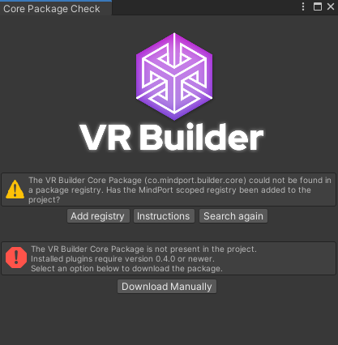

You will need to add a scoped registry to be able to see and download the VR Builder package in the Unity Package Manager. Without a scoped registry, you can still download VR Builder packages as ZIP files and import them as local packages, but you will miss out on updates and a smoother experience.

You can add the registry as usual in Project Settings: click the `Instructions` button to view the data to be entered. Alternatively, clicking the `Add registry` button will attempt to add the registry automatically.

You can see that the registry was added in `Project Settings -> Package Manager`.

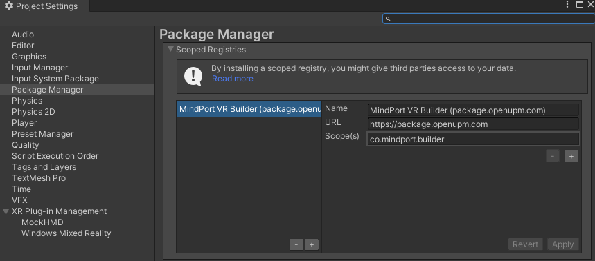

Once the registry has been found, the warning will disappear, and options for automatic download will be made available.

Now you can install the VR Builder package with the click of one button. It is recommended to install the latest version - for troubleshooting, the earliest version supported by the installed add-ons can also be downloaded.
 
Wait until the import has finished and the next pop up appears. Confirm restart to enable the new Unity Input system if necessary.

Wait again until the import is finished. The wizard pops up. This wizard helps you get started and helps to get new or existing scenes set up. We will guide you on how to open a working demo scene. In tab “Welcome”, press `Next` on the bottom right.

VR Builder needs an Interaction Component in order to work. This module acts as a layer between the XR API and VR Builder's interactions. A default Interaction Component based on Unity's XR Interaction Toolkit is provided, and will be prompted for install in the next step. Unless you plan to use some custom or third-party Interaction Component (or to develop your own), just leave it selected and click `Restart`. The required packages will be installed, and then the wizard will restart.

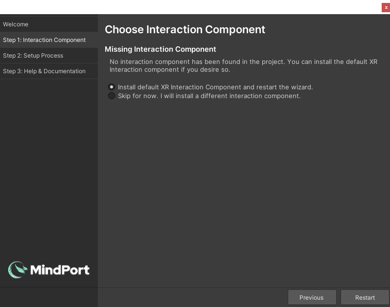

After restarting, you can proceed with the wizard and select “Load Demo Scene”, then press `Next` on the bottom right. You don’t need to take care of the field “Name of your VR Process” as this is not used for the demo.

Confirm copying the sample process to the streaming assets folder.

Select the hardware you want to support and press `Next`.
End the wizard by pressing `Finish`.

Press `Continue` to enable XR Plugin Management and wait until it has finished. Depending on the hardware you selected, a second pop up might appear which you need to confirm again by pressing `Continue`.

Everything is ready. The downloader window should display no further warnings now.

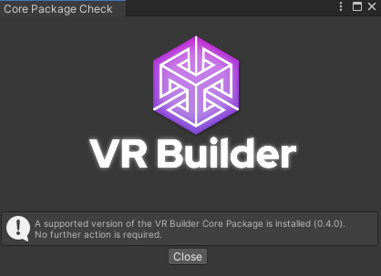

Press Play in the editor to enjoy the VR experience!

**Note:** If you don't open the demo scene from the wizard, you can open it through the menu: `Tools > VR Builder > Open Demo Scene`. This is necessary at least the first time it's opened, as the script will copy the process files to the `StreamingAssets` folder. After that, it can be either opened from the menu or from the project files, like any other scene.

## Demo Scene Overview

The demo scene showcases how it is possible to assemble a process with the building blocks included in the core VR Builder. More building blocks and features will be made available as separate addons.

These building blocks are either conditions or behaviors. Conditions check if the user or the world is in a certain state, and behaviors change the world state when called.

The scene includes three stations. The user can teleport from the starting point to any station and back, and can choose to try the different stations in any order this way.

Snap station: showcases the grab/release conditions, and the snap condition which can be used in conjunction with snap zones.

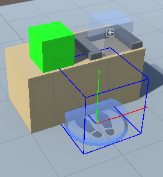

Touch station: showcases the touch condition. Touching the button will trigger a simple behavior, confetti.

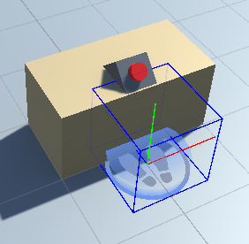

Tool station: showcases how object can be made usable. After grabbing the light sword, press the trigger to extend it.

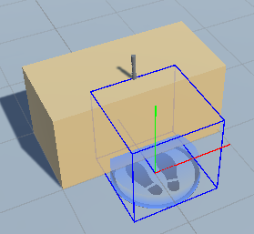

## Demo Scene Hierarchy

Let's have a look at the hierarchy. 

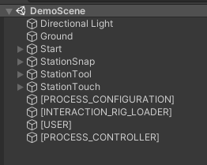

The four game objects in parentheses are automatically added to every VR Builder scene.

- `[PROCESS_CONFIGURATION]` allows to select the process for the current scene from the ones saved in the project.
- `[INTERACTION_RIG_LOADER]` allows to arrange the priority of the available interaction rigs. There should not be need to touch it except for using the simulator and playing the scene without a VR headset.
- `[USER]` is a dummy game object that defines the initial position of the user in the scene. On play, it will be replaced by the real VR rig.
- `[PROCESS_CONTROLLER]` defines some parameters for processes in this scene.

By looking at the other objects in the scene, we can see that some have a `Process Scene Object` component and possibly some "property" component. A `Process Scene Object` is an object with an unique name which can be seen by the process logic. Properties define how the process can interact with the object.

These components can be added manually, or the user will be prompted to add them automatically as needed while building the process.

## Workflow Editor

Now let's see how the process in the demo scene is built. You can open the Workflow Editor from `Tools > VR Builder > Open Workflow Editor` or `Window > VR Builder > Workflow Editor`. The window should look like this.

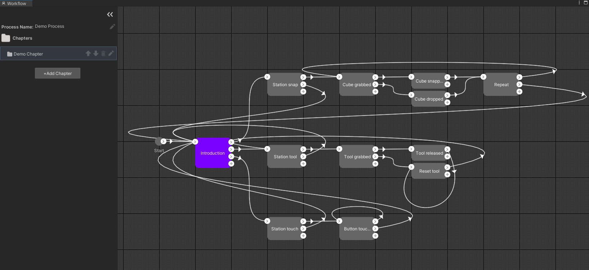

On the left, there is a list of chapters. The demo scene only has one chapter, but processes can have more. Every chapter is a separate section of the process.

On the right, there is a graphical representation of the current chapter. Every node is called a `Step`, and can include a number of `Behaviors` which can happen when the node is triggered or before leaving it. In this example, those are mostly text to speech instructions. A step can have as many exit points, called `Transitions`, as needed. Every transition can list a number of `Conditions` which determine if it can be chosen.

Select, for example, the "Tool grabbed" node. This will open the Step Inspector and the window should look like the following.

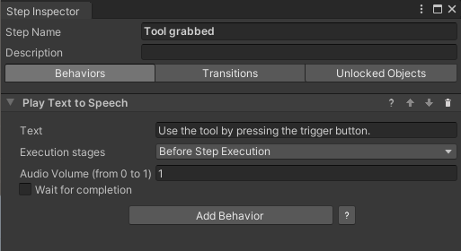

The only behavior is a text to speech instruction that will be triggered when the node is entered. Click on the "Transitions" tab.

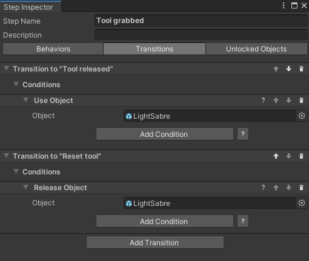

Note there are two transitions, each with its own list of conditions, and more can be added. Each will lead to a different node, depending on which condition is satisfied first.

The first transition will trigger if the object is used (by pressing the trigger on the controller).

The second one if the object is dropped without being used.

Feel free to investigate the other nodes to understand how the demo scene is built.

## Acknowledgements and Additional Documentation

VR Builder is based on the open source edition of the [Innoactive Creator](https://www.innoactive.io/creator). While Innoactive helps enterprises to scale VR training, we adopted this tool to provide value for smaller content creators looking to streamline their processes. 

We too believe in the value of open source and will continue to support this approach together with Innoactive and the open source community around it.

As VR Builder shares the same DNA as the Innoactive Creator, it can be useful check the [documentation for the Innoactive Creator](https://developers.innoactive.de/documentation/creator/v2.11.1/), the majority of which might be applicable to VR Builder as well.

## Contact

You can contact us at [contact@mindport.co](contact@mindport.co) and join our Discord community [here](community.mindport.co).

Feel free to visit our website at [mindport.co](http://www.mindport.co).